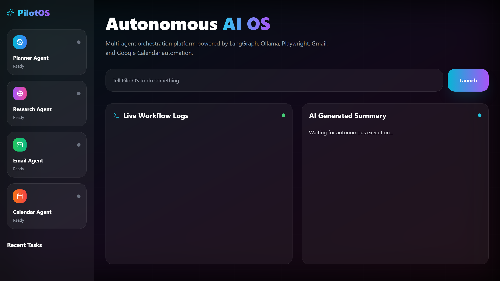
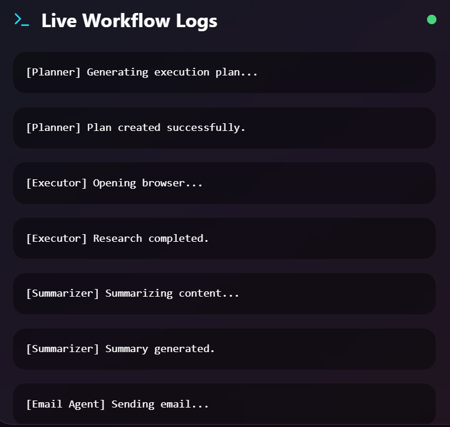
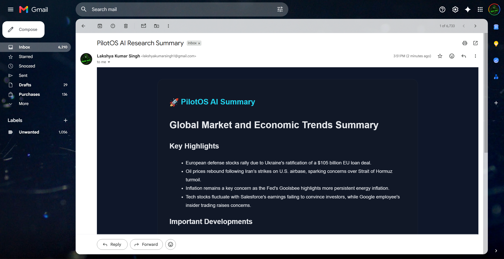
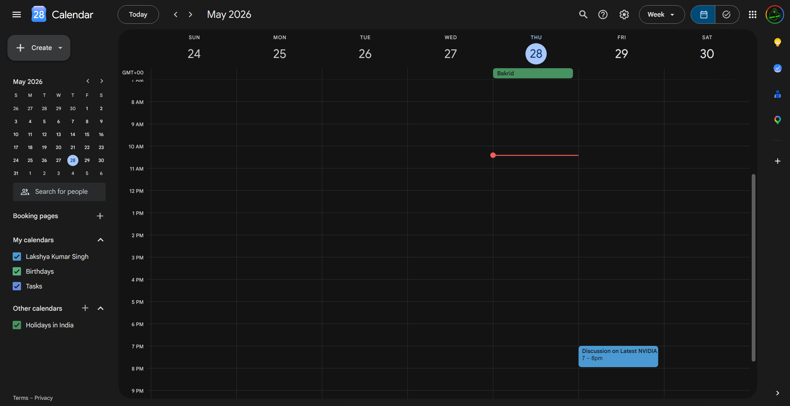
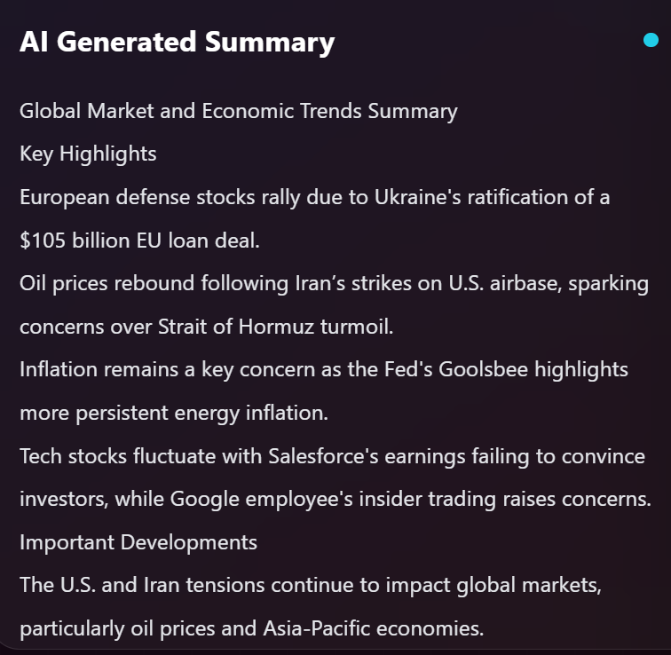
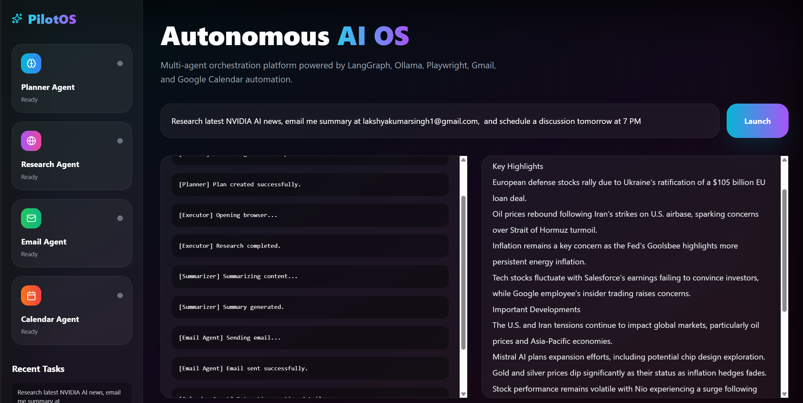

# 🚀 PilotOS — Autonomous Multi-Agent AI Operating System

> An autonomous AI operating system capable of research, AI summarization, email automation, calendar scheduling, and intelligent workflow orchestration using LangGraph + Ollama.

---

# 📚 Table of Contents

1. [Overview](#1-overview)
2. [Key Features](#2-key-features)
3. [System Architecture](#3-system-architecture)
4. [Tech Stack](#4-tech-stack)
5. [Folder Structure](#5-folder-structure)
6. [Frontend Features](#6-frontend-features)
7. [Backend Features](#7-backend-features)
8. [AI Agent Workflow](#8-ai-agent-workflow)
9. [Workflow Orchestration](#9-workflow-orchestration)
10. [How to Run](#10-how-to-run)
11. [Screenshots](#11-screenshots)
12. [Demo Video](#12-demo-video)
13. [Future Improvements](#13-future-improvements)
14. [Contributors](#14-contributors)
15. [Conclusion](#15-conclusion)

---

# 1. Overview

PilotOS is a futuristic autonomous AI operating system capable of executing complex multi-step tasks using intelligent AI agents and workflow orchestration.

The platform combines:

* Autonomous web research
* AI summarization
* Gmail automation
* Google Calendar scheduling
* Multi-agent orchestration
* Conditional workflow execution
* Local LLM integration

PilotOS demonstrates how modern AI systems can move beyond simple chatbots and become autonomous execution engines capable of interacting with real-world tools and services.

---

# 2. Key Features

* 🧠 Multi-Agent AI Architecture
* 🌐 Autonomous AI Research Pipeline
* 📰 Real-Time News Extraction using Google News RSS
* 🔎 Intelligent Article Extraction Pipeline
* 🧠 Compound Multi-Agent Task Execution
* 🤖 AI-Powered Summarization using Ollama
* 📧 Gmail Automation
* 📅 Google Calendar Scheduling
* ⚡ LangGraph Workflow Orchestration
* 🧩 Dynamic Tool Routing
* 📜 Live Workflow Logs
* 🎨 Futuristic Glassmorphism Dashboard
* 📂 Recent Task History
* 📱 Responsive Frontend UI
* 🔄 Compound Multi-Step Task Execution

---

# 3. System Architecture

```text
Frontend (React + TailwindCSS)
        ↓
Axios API Requests
        ↓
FastAPI Backend
        ↓
Router Agent
        ↓
LangGraph Workflow Engine
        ↓
Conditional AI Agents
 ┌───────────────┬──────────────┬──────────────┐
 ↓               ↓              ↓
Research      Email Agent    Calendar Agent
 Agent
 ↓
Google News RSS + Intelligent Article Extraction
 ↓
Ollama Local LLM
 ↓
AI Summaries + Real World Actions
```

---

# 4. Tech Stack

| Technology          | Purpose                |
| ------------------- | ---------------------- |
| React               | Frontend UI            |
| TailwindCSS         | Styling                |
| Framer Motion       | UI Animations          |
| Axios               | API Requests           |
| FastAPI             | Backend Framework      |
| Python              | Backend Language       |
| LangGraph           | Workflow Orchestration |
| Ollama              | Local LLM Runtime      |
| Gmail API           | Email Automation       |
| Google Calendar API | Calendar Scheduling    |
| Google News RSS     | News Research          |
| BeautifulSoup       | Article Extraction     |
| Requests            | HTTP Requests          |
| Pydantic            | Validation             |
| Uvicorn             | Backend Server         |

---

# 5. Folder Structure

```bash
PilotOS/
│
├── backend/
│   ├── agents/
│   │   ├── planner.py
│   │   ├── executor.py
│   │   ├── summarizer.py
│   │   ├── router_agent.py
│   │   ├── email_agent.py
│   │   └── calendar_agent.py
│   │
│   ├── tools/
│   │   ├── browser_tools.py
│   │   ├── gmail_tool.py
│   │   └── calendar_tool.py
│   │
│   ├── workflows/
│   │   └── graph.py
│   │
│   ├── main.py
│   └── requirements.txt
│
├── frontend/
│   ├── src/
│   │   ├── App.jsx
│   │   └── main.jsx
│   │
│   └── package.json
│
└── README.md
```

---

# 6. Frontend Features

## 🌌 Futuristic AI Dashboard

* Modern AI Operating System UI
* Glassmorphism Design
* Animated Background Effects
* Responsive Layout
* Neon Gradient Styling

---

## 📜 Live Workflow Logs

* Real-time workflow visualization
* Animated log rendering
* Auto-scrolling execution logs
* Multi-agent execution tracking

---

## 🧠 Agent Cards

* Planner Agent
* Research Agent
* Email Agent
* Calendar Agent

Each agent displays:

* active state
* workflow status
* execution animation

---

## 📂 Task History

* Stores recent tasks
* Quick execution tracking
* Improved user experience

---

# 7. Backend Features

## ⚡ AI Workflow Engine

* Multi-agent orchestration
* Dynamic conditional execution
* Intelligent task routing
* Workflow state management

---

## 🌐 Research Automation

* Google News RSS integration
* Intelligent article extraction
* Web content scraping via BeautifulSoup
* AI processing pipeline

---

## 📧 Email Automation

* Gmail API integration
* Dynamic recipient detection
* AI-generated email summaries
* Secure OAuth authentication

---

## 📅 Calendar Scheduling

* Google Calendar integration
* AI meeting extraction
* Autonomous event creation
* Smart datetime handling

---

## 🧠 Router Agent

The Router Agent intelligently determines:

* whether research is needed
* whether email automation is required
* whether calendar scheduling is required

This enables:

* dynamic execution paths
* efficient workflow orchestration
* intelligent node skipping

---

# 8. AI Agent Workflow

## Step 1 — Router Agent

The router agent analyzes the user request and determines which tools are required.

Example:

```text
Research latest NVIDIA AI news,
email me summary,
and schedule a discussion tomorrow at 7 PM
```

The router detects:

```json
{
  "research": true,
  "email": true,
  "calendar": true
}
```

---

## Step 2 — Research Agent

The research agent:

* Searches Google News RSS
* Extracts real article URLs
* Scrapes article content
* Combines research context

---

## Step 3 — Summarizer Agent

The summarizer agent:

* Uses Ollama local LLM
* Generates markdown summaries
* Produces structured AI insights

---

## Step 4 — Email Agent

The email agent:

* Sends AI summaries automatically
* Uses Gmail API integration
* Supports dynamic recipients

---

## Step 5 — Calendar Agent

The calendar agent:

* Extracts meeting intent
* Creates Google Calendar events
* Supports automatic scheduling

---

# 9. Workflow Orchestration

PilotOS uses LangGraph to implement:

* Conditional execution graphs
* Multi-agent workflows
* Autonomous orchestration
* Dynamic branching logic

---

## ⚡ Example Compound Task

```text
Research latest NVIDIA AI news,
email me summary at your_email@gmail.com,
and schedule a discussion tomorrow at 7 PM
```

PilotOS automatically:

✅ Researches news  ✅ Summarizes findings  ✅ Sends formatted email  ✅ Creates calendar event

---

# 10. How to Run

## Step 1 — Clone Repository

```bash
git clone https://github.com/X-ImLucky-X/PilotOS.git
cd PilotOS
```

---

## Step 2 — Setup Backend

```bash
cd backend

python -m venv venv

venv\Scripts\activate

pip install -r requirements.txt
```

---

## Step 3 — Setup Ollama

Install Ollama: [https://ollama.com](https://ollama.com)

Run local model:

```bash
ollama run qwen2.5
```

OR:

```bash
ollama run llama3
```

---

## Step 4 — Setup Google APIs

1. Create Google Cloud Project
2. Enable Gmail API
3. Enable Google Calendar API
4. Download `credentials.json`
5. Place credentials inside backend folder

---

## Step 5 — Run Backend

```bash
uvicorn main:app --reload
```

---

## Step 6 — Setup Frontend

```bash
cd frontend

npm install

npm run dev
```

---

## 🔐 .gitignore

```gitignore
credentials.json
token.json
.env
venv/
node_modules/
__pycache__/
```

---

# 11. Screenshots

## 🌌 PilotOS Dashboard



---

## 📜 Workflow Logs



---

## 📧 Email Automation



---

## 📅 Calendar Scheduling



---

## 🧠 AI Summary



---

## Overall



---

# 12. Demo Video

## 🎥 Project Demonstration

Add your demo video link here:

```text
https://your-demo-link.com
```

Recommended demo prompt:

```text
Research latest NVIDIA AI news,
email me summary at your_email@gmail.com,
and schedule a discussion tomorrow at 7 PM
```

---

# 13. Future Improvements

## Planned Improvements

* Voice assistant integration
* WhatsApp automation
* Slack integration
* Memory persistence
* Agent collaboration improvements
* Autonomous task scheduling
* Multi-user support
* Docker deployment
* Cloud deployment
* GitHub automation
* Notion integration
* AI-powered browser navigation
* WebSocket-based live execution logs
* Persistent long-term AI memory
* Better article extraction for blocked websites
* Real-time streaming AI responses
* Mobile companion application
* Autonomous background task execution
* RAG-based memory system
* AI tool marketplace support
* Multi-LLM provider support (OpenAI, Gemini, Claude)
* AI file analysis and document understanding
* Advanced workflow visualization dashboard
* Voice-to-task execution pipeline
* Self-improving agent feedback loops

## Current Research Pipeline Improvements

PilotOS recently upgraded its research pipeline:

* Migrated from unstable browser scraping to Google News RSS
* Added direct article source extraction
* Improved reliability for compound tasks
* Better handling for blocked websites
* Added fallback extraction logic
* Improved multi-agent execution stability

---

# 14. Contributors

| Name                | GitHub                                                            |
| ------------------- | ----------------------------------------------------------------- |
| Lakshya Kumar Singh | [https://github.com/X-ImLucky-X](https://github.com/X-ImLucky-X) |

---

# 15. Conclusion

PilotOS demonstrates how modern AI systems can evolve from simple chatbots into autonomous execution engines capable of interacting with real-world tools and services.

The project combines:

* AI orchestration
* autonomous workflows
* intelligent routing
* real-world automation
* modern frontend engineering
* local LLM infrastructure

into a unified autonomous AI operating system.

---

> ⭐ If you found this project useful, consider starring the repository on GitHub!